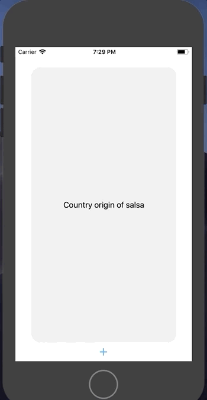
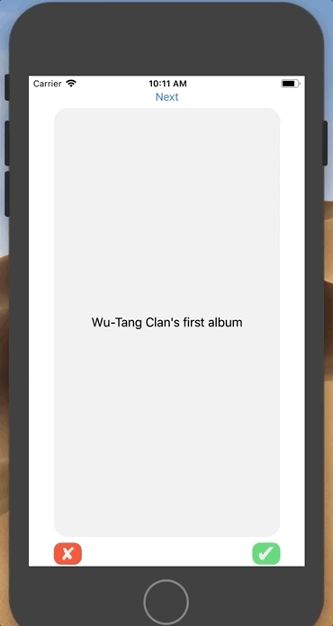

📝 `NOTE` Paste this template at the top of your existing `README.md` file from the last lab.

## Lab 3

### App Description
`TODO://` User can now add multiple add flashcards! Users data is saved if they close the app, so let the studying commence!

## Required
- [x] User can browse through multiple flashcards
- [x] User can re-open the app and see previously created flashcards
- [x] Push code to GitHub

## Lab 2

### App Description
`TODO://` Flashcard app now allows user to add new flashcards to their broaden knowledge!

### App Walk-though
`TODO://` Add the URL to your animated app walk-though `gif` in the image tag below. Make sure the gif actually renders and animates when viewing this README. (☝️ Remove this paragraph after after adding gif)

## Required
- [x] User can open the creation screen
- [x] User can cancel out of the creation screen
- [x] User can enter a new question and answer in the creation screen to then show it on the flashcard
- [x] Push code to GitHub
## Optional
- [ ] User gets an error if they try to create a new flashcard with no question or answer
- [ ] User can edit existing flashcard
- [ ] User can add multiple choice answers in the creation screen

## Flashcards

### App Description
`TODO://` This is the optional. I did only the first two optionals, but I'm still working on this. I'm trying to add haptic feedback to the green button (for when the user gets the flashcard right) on the bottom right. The 'Next' button at the top of the screen is just a temp button until I figure out how to use the swift dictionary to switch the flashcard labels. 

## Required
- [x] Create New Project in Xcode
- [x] Add a view for the front side of the flashcard to display the question
- [x] Add a view for the back side of the flashcard to display the answer
- [x] Build in logic to show the answer side when the card is tapped
- [x] Push code to GitHub
## Optional
- [x] Toggle the flashcard between the question side and the answer side
- [x] Style the question and answer side of the card to better distinguish between the two sides
- [ ] Add selectable multiple choice answers beneath the card

